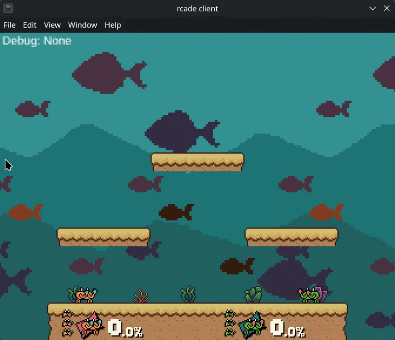
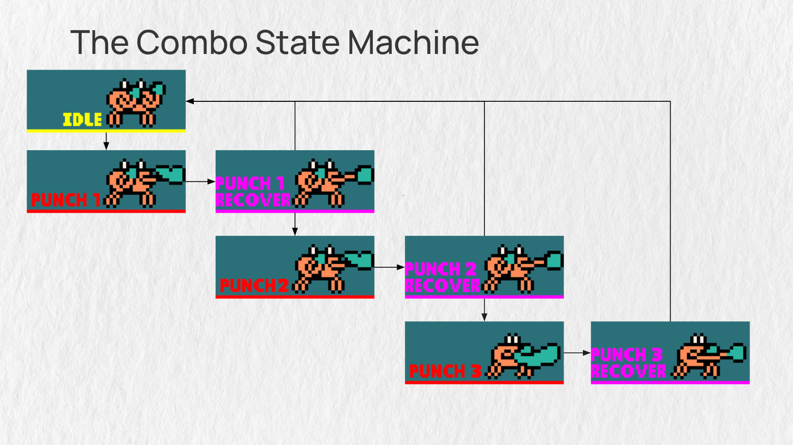
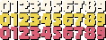

# Super Splash Bros



Super Splash Bros is a 2D fighting game for the [RCade](https://rcade.recurse.com), a custom arcade cabinet built at the Recurse Center.

I built this project as a way to learn Rust. Since the RCade cabinet is an Electron app, the project builds to Web Assembly in order to target the RCade.

## Prerequisites

- [Rust](https://rustup.rs/)
- [Trunk](https://trunkrs.dev/) - `cargo install trunk`
- wasm32 target - `rustup target add wasm32-unknown-unknown`
- NPM
- [Just](https://github.com/casey/just) - Optional, but allows you to run the dev server and emulator simultaneously with one command.

## Getting Started

```bash
just dev
```

This starts the development server and also the RCade cabinet.

## Building

```bash
just build
```

Output goes to `dist/` and is ready for deployment.

## Development Keyboard Controls

When developing locally, keyboard inputs are mapped to arcade controls:

| Player   | Action           | Key |
|----------|------------------|-----|
| Player 1 | UP               | W   |
| Player 1 | DOWN             | S   |
| Player 1 | LEFT             | A   |
| Player 1 | RIGHT            | D   |
| Player 1 | A Button         | F   |
| Player 1 | B Button         | G   |
| Player 2 | UP               | I   |
| Player 2 | DOWN             | K   |
| Player 2 | LEFT             | J   |
| Player 2 | RIGHT            | L   |
| Player 2 | A Button         | ;   |
| Player 2 | B Button         | '   |
| System   | One Player Start | 1   |
| System   | Two Player Start | 2   |

## Fighter Architecture



Character behavior in this game is driven by a state machine. It is through this state machine that fighters are able to perform a combo. 

When a punch input is given, the game transitions the fighter from the `Idle` state to the `Punch 1` state. From `Punch 1`, the fighter transitions into `Punch 1 Recovery`. 

At this point, there is a branch in the state machine: If the player does not press any button, `Punch 1 Recovery` will end and the fighter will return to `Idle`. But if the player presses the A button, the fighter will transition into `Punch 2`. This then repeats and allows the fighter to perform a three punch combo.

### Input Queue

One issue with this state machine approach is that it creates a very small timing window under which players must execute combos. In order to go from `Punch 1` to `Punch 2` and from `Punch 2` to `Punch 3`, players must press the A button exactly within the 4 recovery frames of the previous punch.

To make the inputs less forgiving, this game uses an input queue. Rather than handling inputs only when they arrive, received inputs are placed into a queue with a time-to-live value. The game then checks all inputs from the input queue and sees which are able to be applied at that instant.

The result is that players can press the punch button slightly before the required timing window, and the game will still recognize the input as having been pressed, making it easy to execute the combo.

## Bitmap Fonts



The RCade has a very small (and strange) resolution of 336x262. When rendering text on an HTML canvas of this size, the resulting text can appear very blurry.

To fix this issue, I took the font I wanted and pre-rendered glyphs from that font into an image like the one seen above. Then I stored the location of where each glyph is inside the image.

When the game goes to render a string using a bitmap font, it reads the string one character at a time and uses the character to determine which glyph (and therefore which subsection of the image) should be rendered.

The end result is crisp, pixel-perfect font rendering.
